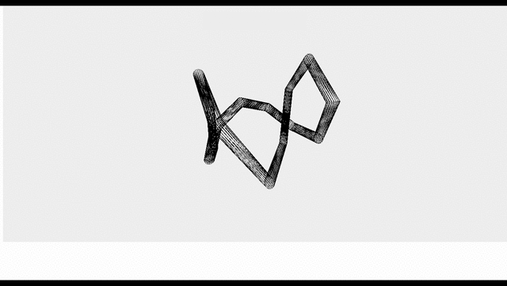

# ThreeJS-Animated-Tunnel
  

Updated: February 14, 2021 
  

  Using Three.JS, we create a cube that calls MeshLambertMaterial and TorusKnotGeometry.  
  A camera element is constantly changing positions on the x, y and z axis.

